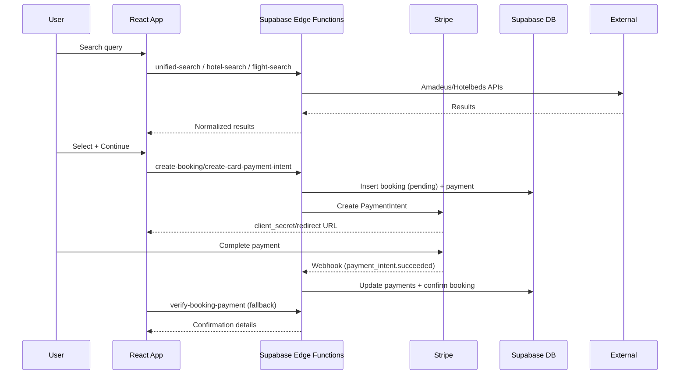
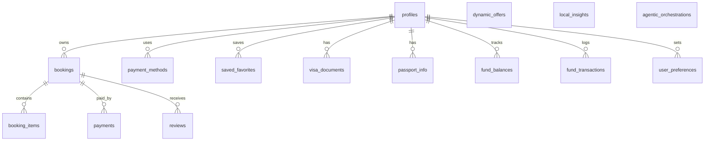

# MAKU Audit — READ ONLY

Preface: This pass intentionally makes no runtime or UI changes. All improvements are delivered as documentation and checklists only. If any access is missing for deeper verification (Netlify build logs, Stripe dashboard, Hotelbeds/Amadeus credentials, n8n), see “Access Needed” at the end.

1) Executive Summary

What works today
- Modern React + Vite + Tailwind app with modular pages and reusable UI components
- Supabase integrated for auth, DB, and edge functions; Stripe used for payments
- Search flows exist for hotels, flights, activities; booking pages scaffolded; AI assistants present
- Strong RLS posture across most tables (bookings/payments linked to user)

Top 10 Risks/Bugs (prioritized)
1. Stripe webhook secret missing: No STRIPE_WEBHOOK_SECRET configured in secrets list; signature verification in stripe-webhook requires it
2. Missing idempotency event store for webhooks: webhook may double-process events on retry
3. Incomplete updated_at management: several tables rely on manual updates; add generic updated_at trigger
4. Potential missing indexes: frequent filters (bookings.user_id, payments.booking_id, created_at) lack explicit indexes in schema snapshot
5. SEO basics inconsistent: per-route titles/meta/OG/canonical/sitemap may be incomplete
6. Image performance: large hero assets likely unoptimized; verify width/height and lazy loading
7. Observability gap: no Sentry/log correlation IDs; limited production error visibility
8. Payment verification coupling: verify-booking-payment and webhook overlap; ensure single source-of-truth and safe retries
9. Supplier API resilience: limited standardized retry/backoff/timeout and schema validation
10. Analytics coverage light: funnel events (search → select → pay) not consistently tracked

Highest-ROI Improvements
- Quick Wins (≤1–2 days): add webhook secret, idempotency table/function, indexes, updated_at trigger, sitemap/canonical/meta, image optimization, minimal funnel analytics, global error boundary
- Strategic Upgrades (1–2 weeks): Sentry + correlation IDs, standardized API client with retries/validation, payment lifecycle hardening (refunds/stales), feature flags, subscription/customer-portal polish

2) Architecture Map
- Framework: React 18 + Vite + Tailwind; react-router-dom for routing
- Data Flow: Client → Supabase Edge Functions → External APIs (Stripe, Amadeus, Hotelbeds) → Supabase DB → Client

Sequence: Search → Select → Pay → Confirmation

Partner/Hotel Portal touchpoints (if present)
- Partners manage inventory via PartnerPortal; data stored in Supabase; assignment hooks to be validated

“LAXMI” Travel Fund Manager touchpoints
- fund_balances/fund_transactions tables present with RLS and update_fund_balance function; needs UI polish and reconciliation flows

3) Feature Inventory & Gaps
- Pages detected: Home, Hotels/Flights/Activities search, Booking steps (baggage, extras, payment, confirmation), Dashboard, Partner Portal, Auth, Deals, Checkout
- Gaps: robust inventory mapping for partner portal; full booking detail/receipt export; verified reviews badge flow; pet/family/solo/spiritual curated lanes; mobile key unlock hooks

Next steps per gap are captured in Backlog.

4) Quality Audit
- Performance: likely LCP heavy on hero; ensure modern image formats, width/height, lazy loading; split heavy pages and vendor chunks; tune Netlify cache headers
- Accessibility: ensure single H1 per route, form labels, focus outlines, correct ARIA on Radix components; keyboard nav throughout checkout
- SEO: add per-route title/meta/canonical and OG; ensure sitemap.xml and robots.txt are correct; consider JSON-LD for listings/articles/FAQs
- i18n readiness: extract strings and layout-friendly copy; plan for currency/locale switch
- Analytics: define event schema for funnel and errors; track in one provider

5) Security & Compliance
- Secrets: Stripe publishable key present; missing STRIPE_WEBHOOK_SECRET; confirm service role usage limited to edge functions; no secrets in code history here
- Auth/RLS: good coverage on user-bound tables; continue to avoid public writes; add audit trail on critical changes
- Payments: webhook validates signature but requires secret set; add idempotency store; avoid PII in logs; add test cases for retries

6) Reliability & DX
- Error boundaries: add global and route-level boundaries
- Logging/Monitoring: add Sentry and correlation IDs passed via headers from FE → Edge → DB
- CI/CD: add type-check, tests, lint, and Lighthouse CI budgets
- Env parity: document dev/stage/prod secrets and endpoints; Netlify contexts

7) Database & API Audit
- ER Diagram included below and exported to /docs/db/ERD.png
- RLS: consistent and restrictive for user data; keep service-only ALL policies limited to functions
- Indexes: propose explicit indexes: bookings(user_id, created_at), payments(booking_id, created_at), booking_items(booking_id), reviews(booking_id), saved_favorites(user_id, created_at)
- API Matrix: unify external API calls via shared client with retries/backoff, 429/5xx handling, and zod validation of responses

8) Backlog & 4-Week Plan
- P0 Blockers
  - Configure STRIPE_WEBHOOK_SECRET; add webhook idempotency table; enable updated_at trigger; add key indexes; add global error boundary
- P1 High Impact
  - Sitemap/canonical/meta; image optimization; minimal analytics; API client with retries + zod; Sentry
- P2 Standard
  - Refund/cancel webhook flow; partner portal hardening; customer portal for subscriptions
- P3 Nice-to-have
  - i18n scaffold; PWA service worker; feature flags

Week-by-Week
- Week 1: Payments hardening (secret + idempotency), DB triggers/indexes, global error boundary, basic analytics
- Week 2: Performance/SEO pass (images, headers, titles/canonical, sitemap), add Sentry and correlation IDs
- Week 3: API client standardization with retries/backoff/zod; verification endpoint consolidation
- Week 4: Refund/cancel lifecycle; portal polish; draft i18n + PWA scaffolds (behind flags)

Access Needed
- Netlify build logs + Headers configuration; Stripe dashboard (webhook endpoints, keys); Hotelbeds/Amadeus credentials & quotas; n8n flows (if any)
